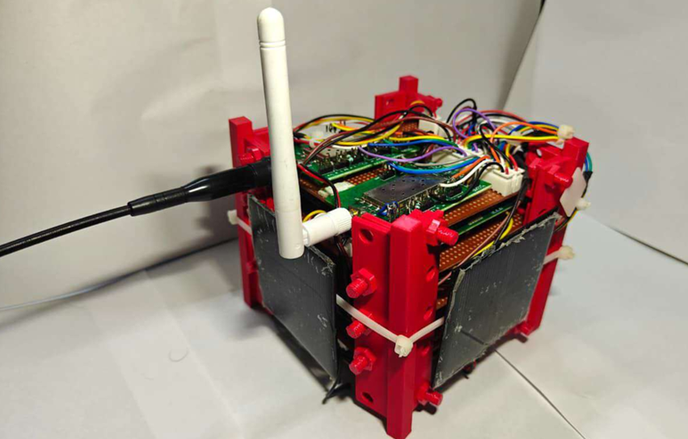
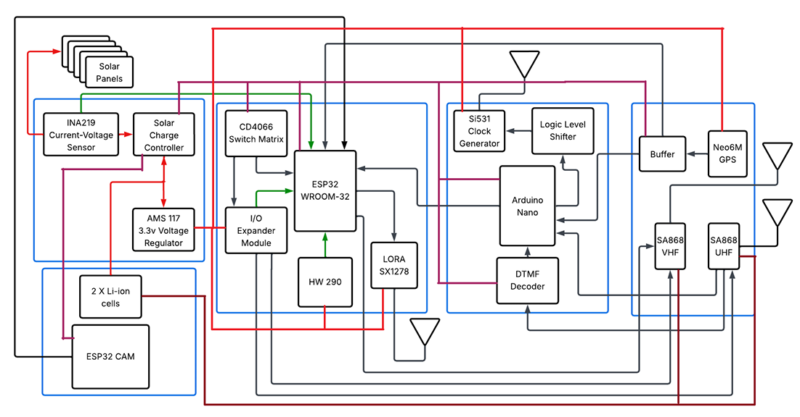
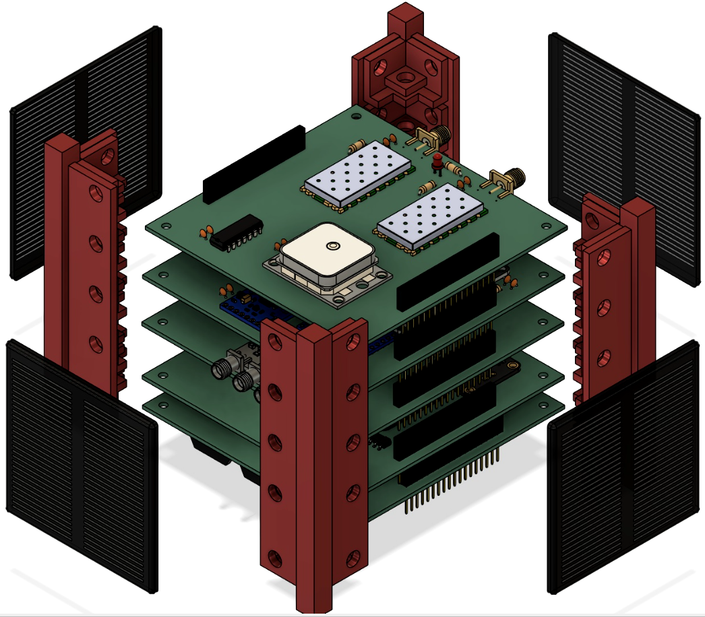

# CubeSat 5-Stack Electronics Architecture 🛰️




A modular **1U CubeSat electronic stack** developed for balloon-based communication and telemetry experiments.

This project focuses on the design, development, integration, and validation of a complete CubeSat electronics platform consisting of five modular PCB subsystems, embedded firmware, ground station software, and 3D mechanical integration.

---

# System Architecture



The CubeSat architecture consists of five modular subsystems:

1. Communication Board  
2. Main On-Board Computer (OBC) Board  
3. Secondary Controller Board  
4. Power Management Board  
5. Battery and Payload Board  

---

# Hardware Implementation

The electronics system was designed using **KiCad** with custom schematic and PCB layouts.

Main hardware components:

- ESP32-WROOM-32 based On-Board Computer
- Arduino Nano secondary controller
- LoRa SX1278 telemetry transceiver
- SA868 VHF/UHF communication module
- ESP32-CAM SSTV imaging payload
- Si5351 WSPR beacon transmitter
- Neo-6M GPS module
- HW-290 IMU sensor
- INA219 power monitoring sensor

---

# PCB Stack Assembly

The CubeSat electronics were implemented as five vertically stacked PCB modules.

PCB design files are available in:

```
Hardware_Design/
```

Includes:

- KiCad schematic files (`.kicad_sch`)
- PCB layout files (`.kicad_pcb`)
- KiCad project files (`.kicad_pro`)

---

# 3D Design



The complete CubeSat mechanical structure was designed using:

- Fusion 360

Includes:

- PCB stack integration
- Structural frame design
- Component placement visualization
- Complete assembly model

Files:

```
3D_Design/
```

---

# Firmware Development

Embedded firmware was developed for:

```
Firmware/
```

Includes:

### CubeSat Onboard Firmware

- ESP32 main controller code
- ESP32-CAM SSTV payload code
- Arduino Nano WSPR beacon code

### Ground Station Software

A web-based dashboard was developed for real-time telemetry visualization.

Features:

- GPS position monitoring
- Altitude display
- Sensor data visualization
- Battery monitoring
- Orientation information

---

# Ground Station


The ground station receives and displays telemetry transmitted from the CubeSat system.

---

# Testing and Validation

The system was validated through rooftop ground-based experiments.

Validated communication modes:

✅ LoRa telemetry transmission  
✅ APRS communication  
✅ SSTV image transmission  
✅ WSPR beacon decoding  

Detailed test results and screenshots:

```
Text_Images/
```

---

# Testing Video

Rooftop demonstration video showing:

- Integrated CubeSat hardware
- Communication testing
- Ground station operation

((https://drive.google.com/file/d/1SzN-sQUl8R-h_qq5jK-UIxGzSsxhfScu/view?usp=drivesdk))

---

# Documentation

Complete project documentation:

```
Documentation/
```

Includes:

- Complete CubeSat Project Report
- Complete System Schematic

---

# Repository Structure

```
CubeSat-5Stack-Architecture

├── Documentation
├── Hardware_Design
├── 3D_Design
├── Firmware
├── Calculations
├── Cubesat_Pictures
├── Text_Images
├── Testing_Video
└── README.md
```

---

# Project Team

**B.Tech Final Year Project**  
Department of Electronics and Communication Engineering  
NSS College of Engineering, Palakkad

Team Members:

- Abhishek B
- Akshay S
- Arunkrishna P U
- Kiran S M

---

# Acknowledgement

Developed as part of the B.Tech Final Year Project under the Department of Electronics and Communication Engineering, NSS College of Engineering, Palakkad.
