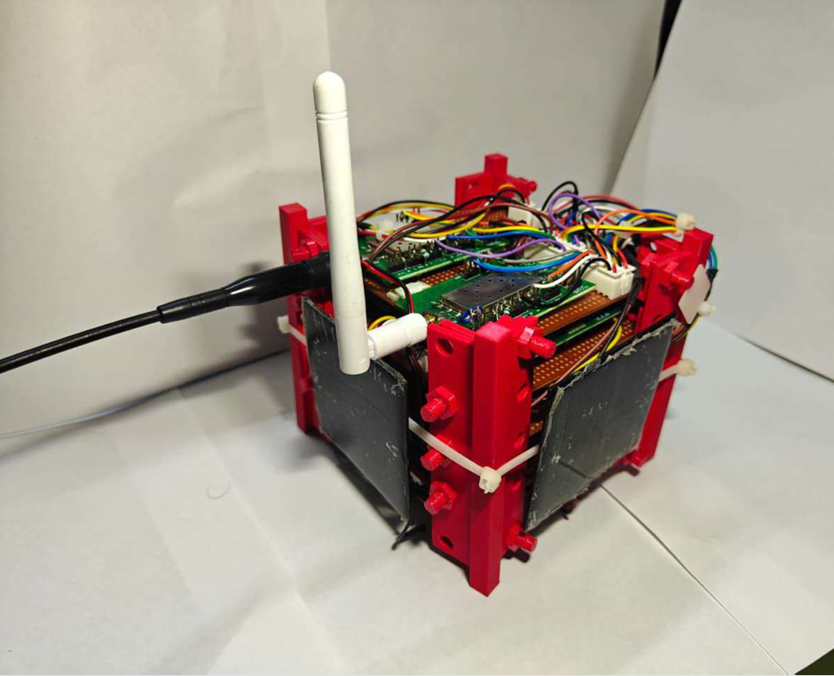

# CubeSat 5-Stack Electronics Architecture 🚀

A modular **1U CubeSat electronic stack** developed for balloon-based communication and telemetry experiments.

This project focuses on the design, development, integration, and validation of a complete CubeSat electronics platform consisting of five modular PCB subsystems, embedded firmware, ground station software, and 3D mechanical integration.

---

# System Architecture


The CubeSat architecture consists of five modular subsystems:

1. Communication Board  
2. Main On-Board Computer (OBC) Board  
3. Secondary Controller Board  
4. Power Management Board  
5. Battery and Payload Board  

---

# Hardware Implementation

Designed using **KiCad** with custom PCB layouts.

The electronics stack includes:

- ESP32-WROOM-32 based OBC
- Arduino Nano secondary controller
- LoRa SX1278 telemetry
- SA868 VHF/UHF communication
- ESP32-CAM SSTV payload
- Si5351 WSPR beacon
- GPS and sensor monitoring

PCB design files:

```
Hardware_Design/
```

Available:
- KiCad schematic files
- PCB layout files
- Project files

---

# PCB Stack Assembly


The CubeSat electronics were implemented as five vertically stacked PCB modules.

---

# 3D Design

The complete mechanical structure was designed using:

- Fusion 360

Includes:

- PCB stack integration
- Structural frame design
- Component placement visualization

Files:

```
3D_Design/
```

---

# Firmware Development

Firmware developed for:

```
Firmware/
```

Includes:

- ESP32 onboard controller
- ESP32-CAM SSTV payload
- Arduino Nano WSPR beacon
- Ground station dashboard

---

# Ground Station


A ground station dashboard was developed for real-time telemetry visualization.

Displayed parameters:

- GPS position
- Altitude
- Sensor data
- Battery monitoring
- Orientation information

---

# Testing and Validation

The system was validated through rooftop ground testing.

Validated communication modes:

✅ LoRa telemetry  
✅ APRS communication  
✅ SSTV image transmission  
✅ WSPR beacon decoding  

Detailed test results:

```
Text_Images/
Testing/
```

---

# Testing Video

Rooftop demonstration video showing:

- Integrated CubeSat hardware
- Communication testing
- Ground station operation

(Add video link here)

---

# Documentation

Complete project report and schematic:

```
Documentation/
```

---

# Repository Structure

```
CubeSat-5Stack-Architecture

├── Documentation
├── Hardware_Design
├── 3D_Design
├── Firmware
├── Calculations
├── Cubesat_Pictures
├── Text_Images
├── Texting_Vieo
└── README.md
```

---

# Project Team

B.Tech Final Year Project  
Department of Electronics and Communication Engineering  
NSS College of Engineering, Palakkad

Team Members:

- Abhishek B
- Akshay S
- Arunkrishna P U
- Kiran S M

---

# Acknowledgement

Developed as part of the B.Tech Final Year Project under the Department of Electronics and Communication Engineering, NSS College of Engineering, Palakkad.
